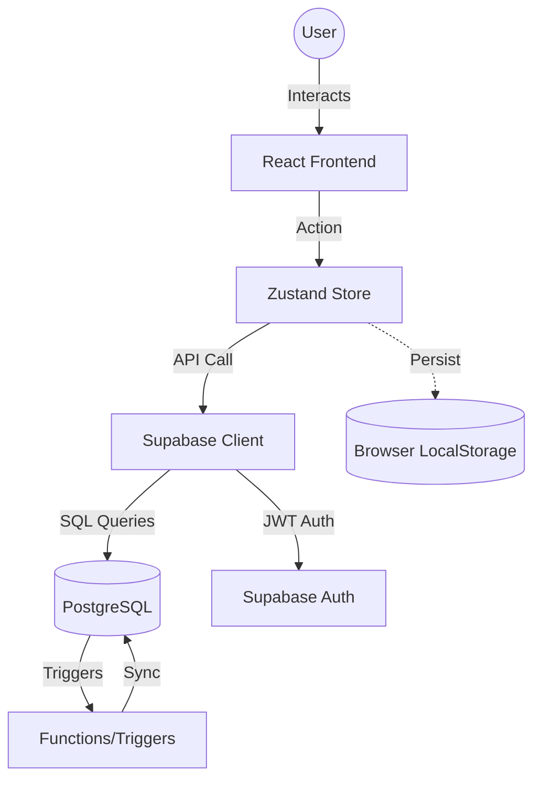

# Architecture & Technical Design

This document provides a deep dive into the engineering principles and design patterns that power the KPIT Task Workflow system.

## 🏗 High-Level Architecture

The system utilizes a **BaaS (Backend-as-a-Service)** model with Supabase, paired with a React-based frontend. The architecture is designed to be "Database-First," meaning the frontend reflects the state of the database atomically.

## 🛠 Design Decisions

### 1. Unified State Management (Zustand)
Instead of prop-drilling or complex Redux boilerplate, we use **Zustand**. 
- **Reasoning**: It provides a hook-based API that is extremely performant. 
- **Persistence**: We utilize the `persist` middleware to cache projects and tasks locally. This allows for an **Instant UI** experience where data is visible immediately upon load, while `fetchProjects` synchronizes with the DB in the background.

### 2. Relational Data Integrity
Unlike NoSQL solutions, we rely on PostgreSQL's relational power:
- **Foreign Keys**: Ensure that tasks cannot exist without projects, and project members must be valid profiles.
- **Triggers**: Automate background tasks like updating `updated_at` timestamps or linking admins to new projects. This reduces frontend logic and ensures data consistency even if the client-side code fails.

### 3. RLS (Row Level Security) as the Firewall
Authorization is handled at the **Database Row Layer**. 
- The frontend doesn't "ask" for data it shouldn't see; the database **refuses** to return rows that the user isn't authorized to view.
- This creates a massive security advantage, as the API surface is inherently limited by the user's JWT identity.

## 🔄 Data Flow: Task Workflow

The lifecycle of a task is controlled by a state machine enforced by both the UI and DB triggers.

1. **Creation**: Admin creates a task in the `todo` state.
2. **Acceptance**: Member accepts task -> Status moves to `in_progress`. DB records `accepted_at`.
3. **Submission**: Member completes work -> Status moves to `in_review`. DB records `submitted_at`.
4. **Validation**: Admin reviews work:
   - **Approve**: Status moves to `done`. `reviewed_at` is set.
   - **Reject**: Status moves back to `in_progress`. Feedback is logged.

## ⚖️ Tradeoffs & Compromises

- **Polling vs Real-time**: While Supabase supports Real-time, we opted for a pull-based model (with optimistic UI updates) to ensure 100% transaction reliability during the initial build. Future versions will integrate `supabase.channel()` for collaborative live updates.
- **Client-Side Enums**: Mapping database enums to UI display strings happens in the Zustand store. This creates a dependency between DB schema names and Store constants, but allows for localized, user-friendly labels.
