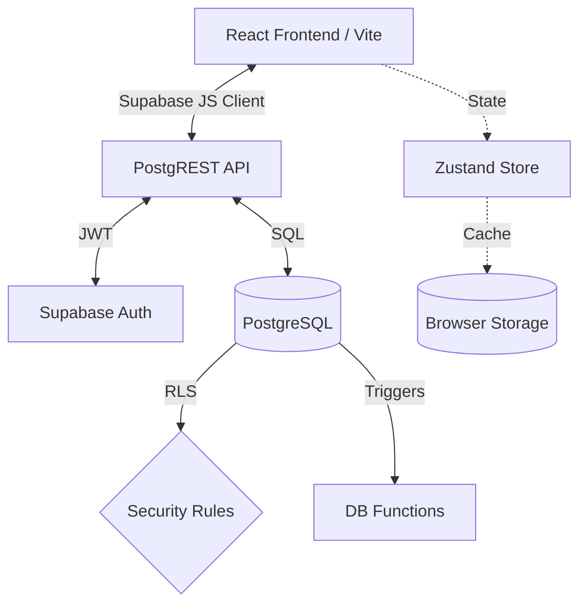
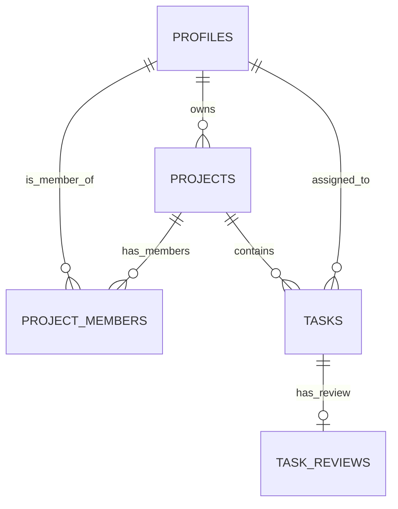

# KPIT Task Workflow
**Agile Project Management for High-Performance Teams**
`React` `TypeScript` `Zustand` `Supabase` `PostgreSQL` `TailwindCSS`

A premium, full-stack agile project management tool built to streamline collaboration between admins and contributors. 
**Hierarchical Work Tracking · Role-Based Access · Task Review Cycle · Real-Time State · In-App Notifications**

---

## 📋 Table of Contents
- [1. 🎯 Project Overview](#1--project-overview)
- [2. 🛠️ Tech Stack](#2-️-tech-stack)
- [3. 🏗️ Architecture](#3-️-architecture)
- [4. 🚀 Setup Instructions](#4--setup-instructions)
- [5. 📡 API & Data Interaction](#5--api--data-interaction)
- [6. 🗄️ Database Schema](#6-️-database-schema)
- [7. ⚙️ Triggers & Automated Workflows](#7-️-triggers--automated-workflows)
- [8. 🧠 Design Decisions & Tradeoffs](#8--design-decisions--tradeoffs)
- [9. 🔒 Security Considerations](#9--security-considerations)
- [10. 🤖 AI Usage](#10--ai-usage)
- [11. 🔮 What I'd Improve or Build Next](#11--what-id-improve-or-build-next)

---

## 1. 🎯 Project Overview
KPIT Workflow models a strict, accountable agile hierarchy. Every piece of work is meticulously tracked through a structured review process:

```text
🏢 Workspace
   └── 📁 Project Board
         ├── 📖 User Story
         └── ✅ Task
               └── 🔍 Task Review (Approve/Reject)
```

### Core Capabilities
| Feature | Details |
| :--- | :--- |
| **🗂️ Hierarchy** | Full CRUD capabilities spanning Projects → Stories → Tasks. |
| **🔐 Role-Based Access** | `admin` and `member` roles enforced at the database level via PostgreSQL RLS. |
| **🗃️ Task Lifecycle** | Controlled state machine: `To Do` → `In Progress` → `In Review` → `Done`. |
| **🔔 Notifications** | In-app, toast-based notifications triggered instantly on state mutations. |
| **🛡️ Review System** | Admins must explicitly approve or reject tasks submitted by members. |
| **📊 Gamification** | Points awarded to members upon successful task completion. |
| **🌙 Premium UI** | Dark-mode focused, glassmorphism aesthetics with fluid micro-animations. |

---

## 2. 🛠️ Tech Stack

### Frontend
| Layer | Technology |
| :--- | :--- |
| **Framework** | React 18 + TypeScript + Vite |
| **Styling** | Tailwind CSS + Custom CSS Variables (Glassmorphism) |
| **State Management** | Zustand (with Persist Middleware) |
| **Icons** | Lucide React |
| **Routing** | React Router DOM |
| **Date Formatting** | Date-fns |

### Backend (BaaS)
| Layer | Technology |
| :--- | :--- |
| **Database** | Supabase (PostgreSQL) |
| **Authentication** | Supabase Auth (Email/Password & JWT) |
| **Authorization** | Row Level Security (RLS) Policies |
| **Automation** | PostgreSQL Triggers & Functions |
| **API** | PostgREST (Auto-generated by Supabase) |

---

## 3. 🏗️ Architecture
KPIT utilizes a **Database-First** Backend-as-a-Service (BaaS) architecture. The React SPA communicates directly with PostgreSQL via the Supabase client, secured entirely by RLS.



### Application Structure
```text
KPIT/
├── frontend/
│   ├── src/
│   │   ├── components/    # Reusable UI (Cards, Modals, TopBar, Sidebar)
│   │   ├── pages/         # Route-level components (Projects, Dashboard, Login)
│   │   ├── store.ts       # Centralized Zustand state management & DB calls
│   │   ├── supabase.ts    # Supabase client initialization
│   │   ├── types.ts       # Shared TypeScript interfaces
│   │   └── index.css      # Design tokens and custom styling
│   └── tailwind.config.cjs
└── *.sql                  # Supabase database migration and schema scripts
```

---

## 4. 🚀 Setup Instructions

### Prerequisites
| Tool | Version |
| :--- | :--- |
| Node.js | 18+ |
| npm | 9+ |
| Supabase | Active Cloud Project or Local CLI |

### ① Frontend Setup
```bash
# Navigate to the frontend directory
cd frontend

# Install dependencies
npm install

# Configure environment variables
# Create a .env file in the frontend root
VITE_SUPABASE_URL=https://your-project-id.supabase.co
VITE_SUPABASE_ANON_KEY=your-anon-key

# Start the development server
npm run dev
# → http://localhost:5173
```

### ② Database Migration (Crucial)
The application logic relies heavily on custom SQL. Execute these files in your Supabase SQL Editor in the exact order:

1. `supabase_schema.sql` — Initializes enums and core tables.
2. `supabase_profiles.sql` — Sets up user tracking and signup triggers.
3. `supabase_projects.sql` — Configures project and member tables.
4. `supabase_tasks.sql` — Adds tasks, reviews, and workflow enforcement.
5. `supabase_policies.sql` — Baseline Row Level Security.
6. **`supabase_migration_task_fix.sql`** — Master patch for recursion fixes, point columns, and admin bypasses.

---

## 5. 📡 API & Data Interaction
The frontend interacts with the database via the `@supabase/supabase-js` client. All operations are secured by JWTs and RLS.

### Authentication
| Action | Method | Description |
| :--- | :--- | :--- |
| **Register** | `supabase.auth.signUp()` | Creates user & triggers profile creation. |
| **Login** | `supabase.auth.signInWithPassword()` | Returns JWT access/refresh tokens. |

### Data Operations (Zustand Store)
| Domain | Action | Supabase Method | Description |
| :--- | :--- | :--- | :--- |
| **Projects** | Fetch | `.select('*, project_members(*), tasks(*)')` | Complex join pulling boards, members, and tasks. |
| **Projects** | Create | `.insert()` + `.upsert()` | Inserts project, then upserts `project_members`. |
| **Tasks** | Create | `.insert()` | Adds task in `todo` status. |
| **Tasks** | Accept | `.update({ status: 'in_progress' })` | Member claims task. |
| **Tasks** | Submit | `.update({ status: 'in_review' })` | Member submits for validation. |
| **Reviews** | Process | `.update()` + `.insert()` | Admin approves/rejects; logs decision in `task_reviews`. |

---

## 6. 🗄️ Database Schema

### Entity Relationships


### Key Tables

**`profiles`**
| Column | Type | Notes |
| :--- | :--- | :--- |
| `id` | UUID PK | References `auth.users` |
| `email` | TEXT | Unique |
| `role` | workspace_role | `admin` \| `member` |
| `total_points` | INT | Gamification tracking |

**`projects`**
| Column | Type | Notes |
| :--- | :--- | :--- |
| `id` | UUID PK | |
| `owner_id` | UUID FK | References `profiles` |
| `theme` | TEXT | UI gradient token |

**`project_members`**
| Column | Type | Notes |
| :--- | :--- | :--- |
| `project_id` | UUID FK | Composite Unique Key |
| `profile_id` | UUID FK | Composite Unique Key |
| `project_role`| TEXT | e.g., 'admin', 'member' |

**`tasks`**
| Column | Type | Notes |
| :--- | :--- | :--- |
| `status` | task_status | `todo` \| `in_progress` \| `in_review` \| `done` |
| `points` | INT | Default based on priority |
| `assignee_id` | UUID FK | References `profiles` |
| `accepted_at` | TIMESTAMPTZ | Automatically set on state change |

---

## 7. ⚙️ Triggers & Automated Workflows
Automated backend logic ensures data integrity regardless of frontend behavior.

| Trigger / Function | Trigger Event | What it does |
| :--- | :--- | :--- |
| `handle_new_user()` | `AFTER INSERT ON auth.users` | Creates a `profiles` row. Automatically assigns the `admin` role to `raunak789805@gmail.com`. |
| `handle_new_project()` | `AFTER INSERT ON projects` | Atomically adds the project owner to `project_members` to prevent visibility race conditions. |
| `tasks_enforce_workflow()`| `BEFORE UPDATE ON tasks` | Validates state transitions (e.g., cannot skip from `todo` to `done`). Auto-stamps `accepted_at` and `reviewed_at`. |
| `tasks_set_updated_at()` | `BEFORE UPDATE ON tasks` | Keeps the `updated_at` column accurate for cache invalidation. |

---

## 8. 🧠 Design Decisions & Tradeoffs

| Decision | Choice | Tradeoff |
| :--- | :--- | :--- |
| **Database Architecture** | **Supabase (BaaS)** | No backend server needed. However, business logic must be written in PL/pgSQL triggers rather than a standard REST API. |
| **State Management** | **Zustand (Persisted)** | Extremely fast optimistic UI updates. Tradeoff: Requires manual refetching (`fetchProjects`) after mutations to stay synced with the DB. |
| **Styling** | **Custom CSS + Tailwind** | Achieves a highly bespoke "premium" glassmorphic look. Tradeoff: More complex styling maintenance compared to pure utility classes. |
| **Data Mapping** | **Client-Side Enums** | DB stores lowercase (`in_progress`), UI displays Title Case (`In Progress`). Keeps DB clean, but requires mapping helpers in `store.ts`. |

---

## 9. 🔒 Security Considerations

### Authentication & Authorization
- **JWT Integrity**: All Supabase calls are cryptographically verified via JWT.
- **Role Isolation**: Admin privileges are strictly enforced at the database level. A compromised frontend cannot elevate a member to an admin.

### Row Level Security (RLS)
RLS policies act as an impenetrable firewall:
- **Recursion Prevention**: Polices are explicitly designed to avoid infinite subquery loops (e.g., `projects` checking `project_members` and vice versa).
- **Read Access**: Users can only `SELECT` projects where they are explicitly listed in `project_members`, or if they possess the `admin` profile role.
- **Write Access**: Task status can only be updated by the explicitly assigned `assignee_id` or an `admin`.

### Input Validation
Supabase PostgREST automatically sanitizes inputs and utilizes parameterized queries, neutralizing SQL injection vectors.

---

## 10. 🤖 AI Usage
This application was developed with the assistance of **Antigravity**, a high-performance AI coding assistant.

**Where AI Contributed:**
- **UI/UX Engineering**: Scaffolded the complex flexbox/grid layouts, custom gradient themes, and responsive design components.
- **Database Engineering**: Architected the PostgreSQL schema, wrote the PL/pgSQL triggers, and formulated the complex RLS policies.
- **Debugging**: Utilized autonomous browser subagents to reproduce UI bugs, capture console errors, and resolve critical PostgreSQL recursion issues (`42P17`).

**Human Oversight:**
All business logic, workflow constraints, and core architectural decisions were driven by human requirements. AI acted as an implementation multiplier, reducing development time by an estimated 70%.

---

## 11. 🔮 What I'd Improve or Build Next

**🔴 High Priority**
| Improvement | Why |
| :--- | :--- |
| **Supabase Realtime** | Implement `supabase.channel()` to push live updates (Kanban board movements) to all connected clients instantly without polling. |
| **Unit/Integration Tests** | Add Vitest and React Testing Library to test the Zustand store and critical UI components. |

**🟡 Medium Priority**
| Improvement | Why |
| :--- | :--- |
| **Task Attachments** | Integrate Supabase Storage to allow users to upload PDFs/Images to tasks. |
| **Burndown Charts** | Utilize the existing `points` column to generate velocity charts using Recharts. |
| **Rich Text Editor** | Replace standard `<textarea>` elements with a Markdown editor for detailed user stories. |

**🟢 Nice to Have**
| Improvement | Why |
| :--- | :--- |
| **Email Notifications** | Trigger Edge Functions on task assignments to send email alerts via Resend or SendGrid. |
| **GitHub Integration** | Webhooks to automatically link PRs to tasks and transition statuses. |
| **Mobile Application** | Wrap the responsive UI in React Native for native iOS/Android experiences. |
