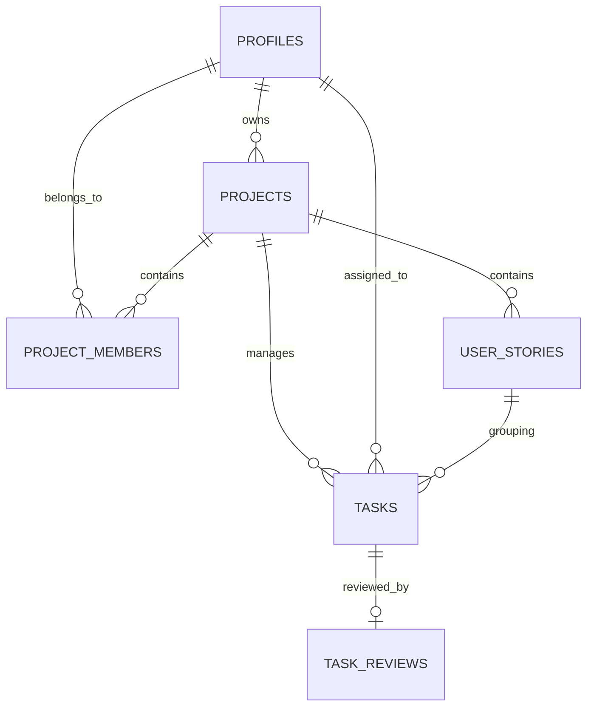

# Database Schema Documentation

This document details the relational structure of the KPIT Task Workflow database.

## 📊 Entity Relationship Diagram

## 🗄 Table Definitions

### 1. `profiles`
Maintains user identity and gamification points.
- `id` (UUID, PK): Primary identifier linked to Supabase Auth.
- `role` (workspace_role): Enum `admin` | `member`.
- `total_points` (INT): Accumulated points from completed tasks.
- `title` (TEXT): Custom designation (e.g., 'Lead Developer').

### 2. `projects`
Containers for task boards.
- `owner_id` (UUID): References the creator profile.
- `theme` (TEXT): CSS gradient tokens for UI branding.

### 3. `project_members`
A join table facilitating many-to-many relationships between projects and users.
- `project_id` (UUID, FK)
- `profile_id` (UUID, FK)
- `project_role` (TEXT): Context-specific role (e.g., 'Reviewer').

### 4. `tasks`
The core transactional table.
- `points` (INT): Reward value for completion.
- `status` (task_status): `todo`, `in_progress`, `in_review`, `done`.
- `assignee_id` (UUID, FK): The user responsible for execution.

### 5. `task_reviews`
Audit log for quality control.
- `decision` (review_decision): `approve` | `reject`.
- `comment` (TEXT): Feedback from the admin.

## ⚙️ Automated Logic (Triggers)

### `on_auth_user_created`
- **Location**: `profiles`
- **Purpose**: Creates a profile row immediately after signup.
- **Role Logic**: Automatically assigns `admin` role to `raunak789805@gmail.com`.

### `on_project_created`
- **Location**: `projects`
- **Purpose**: Automatically adds the creator to the `project_members` table to ensure immediate visibility.

### `tasks_enforce_workflow`
- **Location**: `tasks`
- **Purpose**: A safety net trigger that populates `accepted_at`, `submitted_at`, and `reviewed_at` timestamps based on status transitions.
